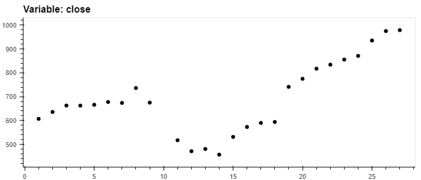
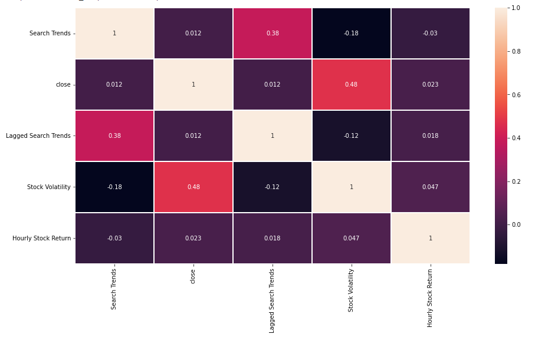
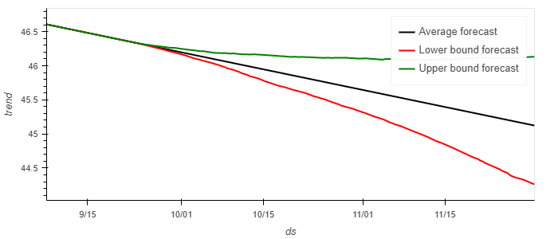
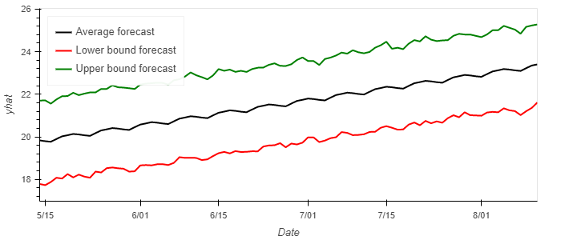

# Module-11-Challenge-Financial-Forecast

## Introduction
With over 200 million users, MercadoLibre is the most popular e-commerce site in Latin America. The analysis notebook included evaluates how the company's Google Search traffic correlates to its stock price. Additionally, a Prophet forecast model is used to predict hourly user search traffic, as well as to forecast the company’s future revenue.

## Summary of Results
The main analysis findings are as follows:
1. The stock price only appears to correlate well (r=0.41) with the search traffic in 2020 after the beginning of the COVID shutdown, as shown below. 

2. Attempts to find correlations between lagged traffic search (by 1 hr period), and stock volatility and returns were futile, as very low values of r were obtained.See below.

3. The search traffic forecast indicates a decline in popuylarity is to be expected for the second half of 2020. See below.

4. Despite the decline in popularity, revenue is forecast to increase over the next quarter as shown in the plot below.

More details of the analysis can be found in the notebook.